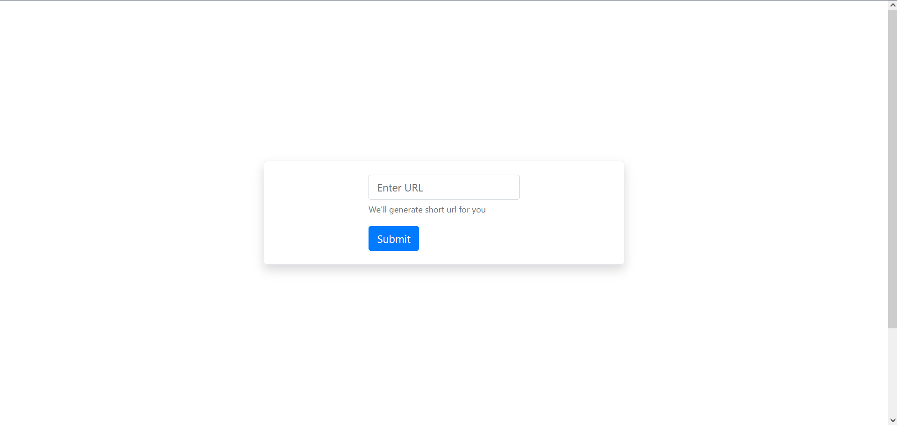
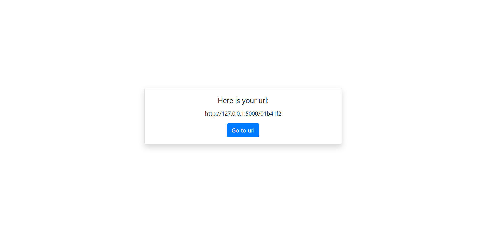

# URL_Shortener
My first Python Flask project.
URL Shortener using Bootstrap.

# Roadmap
* DB Persistency using SQLite 
* Fill in content (Too empty)
* Add user authorization 
* Add user linked URLs

# Images

    
    

